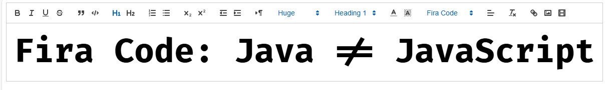

# Quill Rich Text Editor in Angular with custom fonts



## Steps to integrate Quill Editor in Angular with custom fonts.

I will use FiraCode font in this example. As it is the best font in entire universe.

## Prepare, download fonts

Link to download FiraCode font: https://github.com/tonsky/FiraCode
FiraCode-Regular.ttf is in `/public` folder.

## Install ngx-quill

```bash	
npm install ngx-quill
```

Create a toolbar configuration. Pay attention to the font property. I added 'firacode' there.

```typescript
const modules = {
  toolbar: [
    ['bold', 'italic', 'underline', 'strike'],        // toggled buttons
    ['blockquote', 'code-block'],

    [{'header': 1}, {'header': 2}],               // custom button values
    [{'list': 'ordered'}, {'list': 'bullet'}],
    [{'script': 'sub'}, {'script': 'super'}],      // superscript/subscript
    [{'indent': '-1'}, {'indent': '+1'}],          // outdent/indent
    [{'direction': 'rtl'}],                         // text direction

    [{'size': ['small', false, 'large', 'huge']}],  // custom dropdown
    [{'header': [1, 2, 3, 4, 5, 6, false]}],

    [{'color': []}, {'background': []}],          // dropdown with defaults from theme
    [{'font': ['firacode']}],
    [{'align': []}],

    ['clean'],                                         // remove formatting button

    ['link', 'image', 'video']                         // link and image, video
  ]
};

```

## Add quill-editor tag

```html

<quill-editor
  format="text"
  [(ngModel)]="content"
  [modules]="quillConfiguration"
  (onContentChanged)="onContentChanged($event)"
  [placeholder]="'Winter is coming...'"

></quill-editor>
```

## Prepare Styling

Extend your angular.json file with the following styles.

```json
  "styles": [
"src/styles.scss",
"quill/dist/quill.core.css",
"quill/dist/quill.snow.css"
]
```

## Add styling to your global styles.scss file.

```scss
[quill-editor-toolbar] .ql-font span[data-label="Fira Code"]::before {
  font-family: "Fira Code";
}

.ql-font-firacode {
  font-family: "Fira Code";
}

.ql-snow .ql-picker.ql-font .ql-picker-label[data-value=firacode]::before, .ql-snow .ql-picker.ql-font .ql-picker-item[data-value=firacode]::before {
  content: 'Fira Code';
}
```

## Add provider into app.config.ts

```typescript

provideQuillConfig({
  customOptions: [{
    import: 'formats/font',
    whitelist: ['firacode', 'roboto', 'serif', 'monospace']
  }]
})

```

## Embed fonts in your index.html file.

Google Roboto Example

```html

<link href="https://fonts.googleapis.com/css?family=Fira+Code" rel="stylesheet">
  ```
  
you also need to repeat css steps for roboto.
